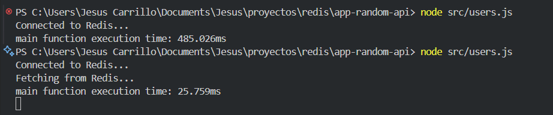

# Proyecto de optimización de consultas con Redis

Este proyecto utiliza Redis para optimizar las consultas a la base de datos.

## Uso

Para utilizar este proyecto, sigue los siguientes pasos:

1. Clona el repositorio.
2. Instala las dependencias con `npm install`.
3. Inicia el servidor con `npm start`.

## Imagen del proyecto

## Redis

Este proyecto utiliza Redis para almacenar en caché las consultas a la base de datos, lo que mejora significativamente el rendimiento de las consultas.

## Contribuir

Si deseas contribuir a este proyecto, por favor realiza un 'fork' del repositorio y envía un 'pull request'.
